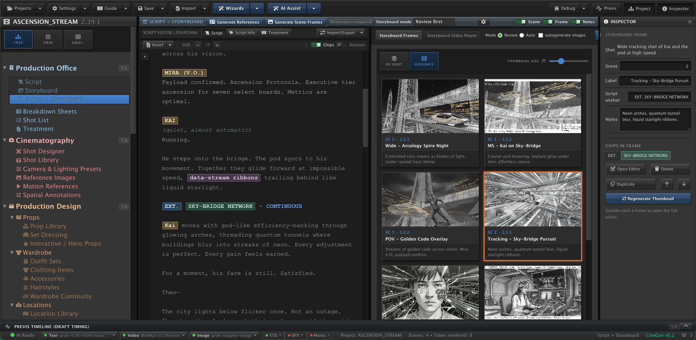
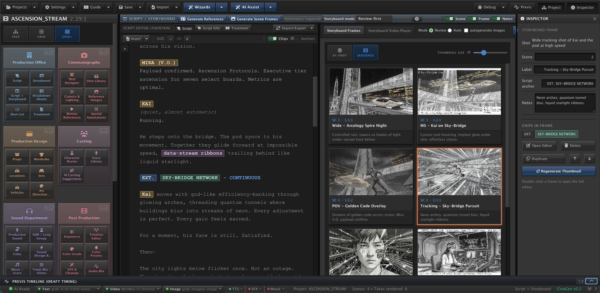

CineGen

CINEGEN IS UNDER DEVELOPMENT.

---

AUDIENCE AND PURPOSE

This filmmaking web app is intended to be a user-friendly, BYOK (Bring
Your Own Keys) that a person can run on
his own computer or server. Before launching the app
for the first time, the user will have signed up with
one or more AI service providers to enter API keys in
the app during setup.  An onboarding assistant modal
appears when the app is first launched.

---

## Tree View of Project Hierarchy - Script + Storyboard (sample project)

## Grid+ view of Project Hierarchy - Script + Storyboard — (sample project)

## Run / deploy this folder

This directory is the **uploadable app bundle** (frontend + backend proxy). See **[DEPLOY.md](./DEPLOY.md)** for `npm install`, `npm run dev`, `npm run build`, and `npm start`.

---

"Here are three storyboard images.  Which one?"

---

1. Goals

The app is designed to be driven by the mental model
and logic of filmmaking.  It is designed to draw from
traditional filmmaking production and adapt its various
terms, stages, and departments for AI media generation
and organization. It is supposed to provide a flexible
software environment, accommodating not only the
structure of filmmaking but also workflows as they can
occur in software.

2. Organization

I was considering a production department layout, where you have the Sound Department, Production Design, Location Scout, Cinematographer, etc., and each sub section has its own information layout, such as Wardrobe under Production Design, and Prop Department.  This way it bridges closely to the mental model of filmmaking where there are people in charge of differnt subsections and these subsections in the GUI will be tailored, not just templates for editing data.  The Wardrobe section should have a different layout than the Props layout in whatever way suits it.  Doing this will 
make functions and processes easy to find in the app.

2. Audience

The app is intended to be a user-friendly BYOK (Bring
Your Own Keys) open source app that a person can run on
his own computer or server. Before launching the app
for the first time, the user will have signed up with
one or more AI service providers to enter API keys in
the app during setup.  An onboarding assistant modal
appears when the app is first launched.

Entering AI service API keys is a task usually reserved
for advanced users and software developers, but as long
as the user signs up with the right services, it should
be as simple as copying and pasting the keys into the
onboarding modal pane. The app should act as a consumer
product and assist the user in the setup of anything,
make clear the status of any important process or
setting, make navigation pathways evident for the task at
hand, and not just leave raw configs and settings as
might happen in open source software.

3. UI Flow

The user will be able to start with a script, generate
a storyboard, work with assistants to make all items,
such as wardrobe, location, etc.

The filmmaker is to work within a hierarchy of
interaction with the program, with the top layers
reflecting how movies are made: pre-production,
production design, production. The filmmaker can move
between sections with the project hierarchy sidebar.

In real life, if anything is to appear in a frame, it
has to be chosen, but since AI is generating the frames
specifics have to be provided or the AI will fill in
every detail on its own.  The app provides various
production design categories like wardrobe, props, and
hairstyles so that the filmmaker can take filmmaking
outside of basic AI output and make it tailored for the
given production.

All items, from characters to locations, will be
displayed as "chips" throughout the UI which means that
they are cross-referenced and easily accessed from any
section where they are present.

Having terms like Coverage and Master Shot driving the
program at top levels of the app's interface hierarchy
means that the features of the program are not just
parameters in panes but familiar filmmaking concepts.

AI is generating products from real world film
production.

For this reason, the UI can be organized by filmmaking
logic, not by technical layers (prompts, motion
strength, seeds, etc.).

